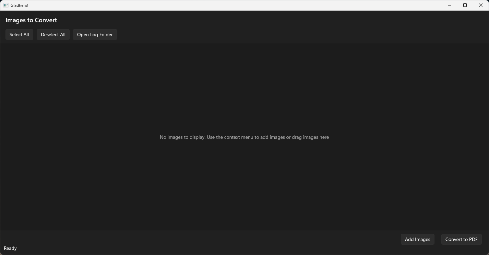
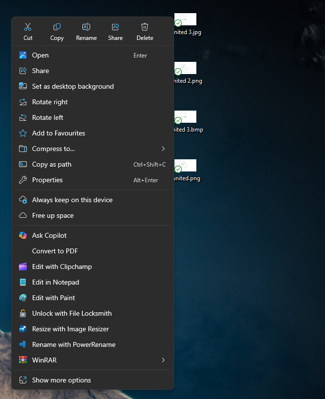

# Gladhen 3
Gladhen 3 is winui3 application that allows you to convert your images to a single pdf file. Suported images formats are png, jpg, jpeg and bmp.

## Features
- Convert multiple images to a single pdf file
- Context menu integration
- Drag and drop support
- Supports png, jpg, jpeg and bmp formats

## Demo
[video demo](https://vimeo.com/1100946157)

## Installation
Currently, the application is still in development, but you can download the latest version from [Releases](https://github.com/armiaab/Gladhen3/releases).
To install the application, run the install.ps1 file and follow the instructions.
