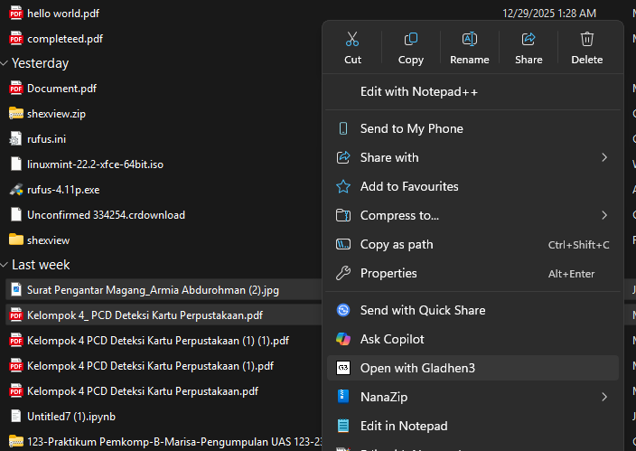
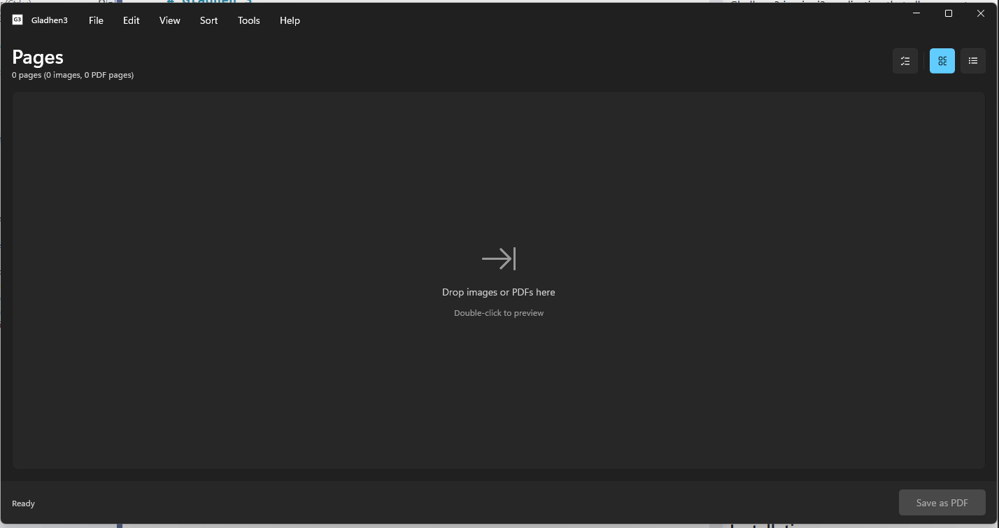
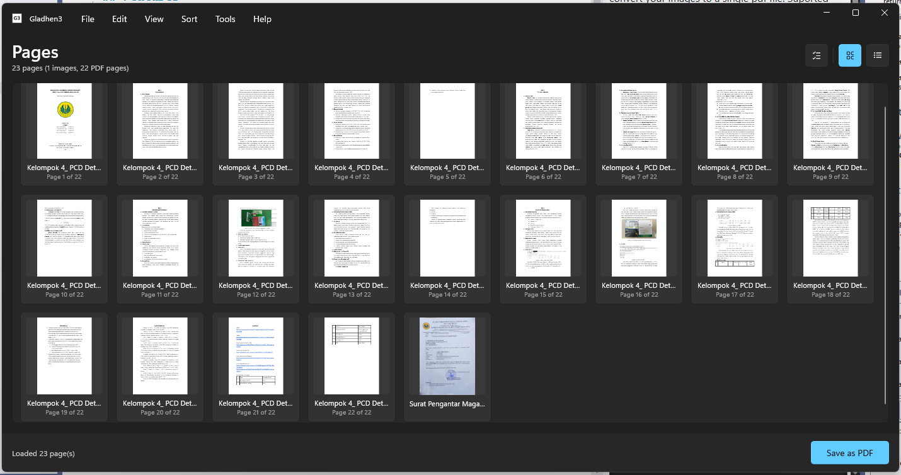

# Gladhen 3
Gladhen 3 is winui3 application that allows you to convert, merge, and compress a pdf. Supported files: .png, .jpg, .jpeg, .pdf

## Features
- Convert multiple images to a single pdf file
- Context menu integration
- Drag and drop support
- Supports png, jpg, jpeg, bmp, pdf formats
- Cutomize the page size and orientation
- Reorder images before conversion
- Split pdf
- Merge pdf with image or another pdf
- Preview image and pdf files
- Compress PDF

## Screen Shots

## Installation
[Microsoft Store](https://apps.microsoft.com/detail/9PKH3VS88B8Q?hl=en-us&gl=US&ocid=pdpshare)
