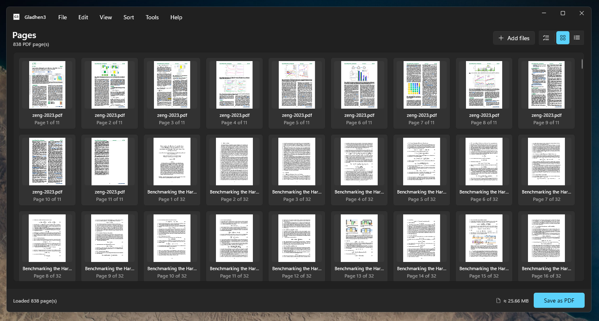
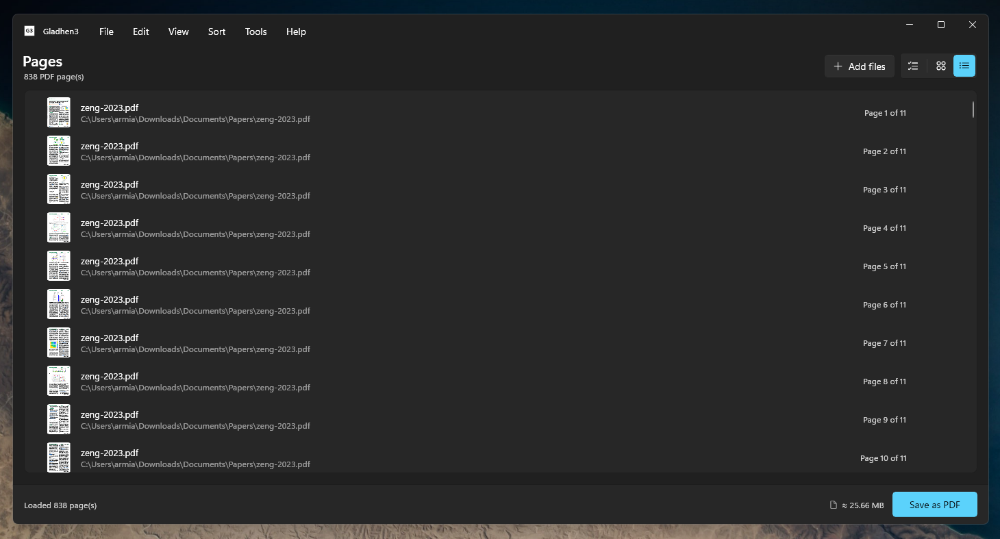
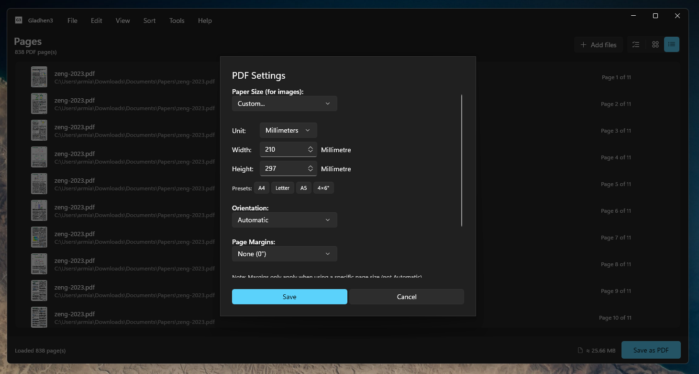
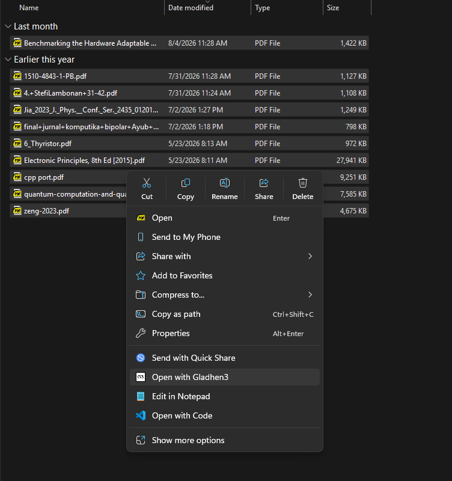

# Gladhen 3

Gladhen 3 is a WinUI 3 application for building, merging, splitting and compressing PDFs on Windows. Drop images and PDFs in, arrange the pages, and save one file.

## Features

- Convert one or many images into a single PDF
- Merge PDFs with each other or with images
- Split a PDF by removing the pages you don't want before saving
- Compress the output with **Low / Medium / High** presets (300 / 150 / 96 DPI), with text left selectable
- **See the estimated file size before you save**, updated as you add pages or change settings
- Customise paper size (Automatic, A4, Letter, Legal, A3 or custom), orientation and margins
- Reorder pages by dragging, or sort them by name or type
- Thumbnail and list views, with a select mode for removing pages in bulk
- Preview any page by double-clicking it
- Explorer context menu integration — right-click files and choose *Open with Gladhen3*
- Drag and drop straight into the window

### Supported files

**Images** — JPG, JPEG, PNG, BMP, GIF, TIFF, TIF, WEBP, HEIC, HEIF, ICO, WDP, HDP, JXR, DDS, RAW, CR2, NEF, ARW, DNG

**Documents** — PDF

The Explorer context menu is registered for JPG, JPEG, PNG, BMP, GIF, TIFF, TIF and PDF.

### Keyboard shortcuts

| Shortcut | Action |
|---|---|
| `Ctrl` + `O` | Add files |
| `Ctrl` + `E` | Toggle select mode |
| `Ctrl` + `A` | Select all |
| `Delete` | Remove selected pages |

## Screenshots

Thumbnail view — every page of every file you have added, ready to be reordered:

List view, with the estimated output size next to the save button:

Page setup for images, including custom sizes, orientation and margins:

Right-click any supported file in Explorer:

## Installation

[Get it from the Microsoft Store](https://apps.microsoft.com/detail/9PKH3VS88B8Q?hl=en-us&gl=US&ocid=pdpshare)

Install and run — there is nothing else to download. The .NET runtime is carried inside the
package, and the Windows App Runtime is a framework dependency the Store installs for you.

Requires Windows 10 version 1809 (build 17763) or newer, x64 or x86. The download is about
43 MB for x64 and 40 MB for x86; the Store sends only the one your PC needs.
